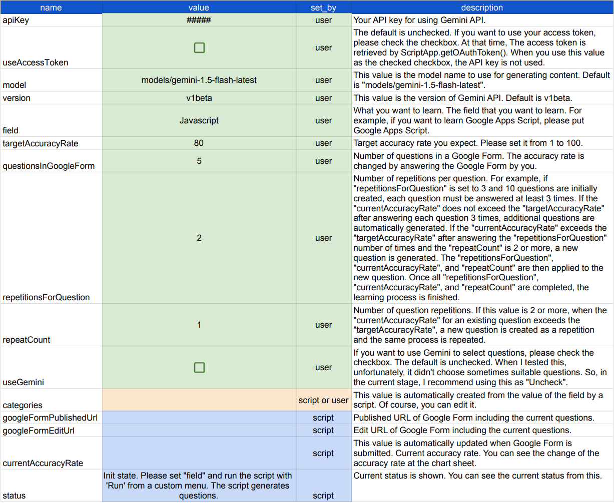

# A Novel Approach to Learning: Combining Gemini with Google Apps Script for Automated Q&A

# Abstract

This report proposes a novel learning method using Gemini to automate Q&A generation, addressing the challenges of manual Q&A creation. By integrating with Google tools, this approach aims to enhance learning efficiency, accessibility, and personalization while reducing costs.

# Introduction

Mastering a new subject often demands a significant time commitment. A proven strategy for efficient learning is through question-and-answer (Q&A) practice. This method typically involves constructing a dataset of pertinent Q&A pairs and subsequently engaging in repeated practice until desired proficiency levels are achieved. While platforms such as Google Forms and Google Apps Script can streamline the Q&A creation and evaluation process, the manual generation of Q&A data remains a time-consuming and expensive endeavor. Minimizing the operational costs associated with scripting is crucial for long-term sustainability.

To overcome this hurdle, we introduce a novel methodology that harnesses the power of Gemini, a large language model, to automate the generation of Q&A data. By streamlining the creation process, we aim to make learning accessible and efficient across a wide range of subjects. Moreover, by meticulously analyzing the history of answered questions, we can pinpoint learners' strengths and weaknesses, thereby enabling tailored learning experiences.

This report presents a groundbreaking learning approach that integrates Gemini with widely used Google tools: Forms, Spreadsheets, and Apps Script as an application implemented on Google Spreadsheet. Given the extensive adoption of these Google applications, we anticipate that this method will be widely embraced and yield substantial benefits for a diverse user base.

# Flow charts

Fig 1. Learning process with a script and a manual operation.

Fig 2. Learning process with a script and Gemini.

Figures 1 and 2 illustrate the flow of the learning process for two scenarios: (1) using a script and manual operation, and (2) using a script and Gemini. In Fig. 1, the questions are required to be manually prepared. And, when the summary for answers is also required to be manually created. On the other hand, in Fig. 2, when Gemini is used, those can be automatically generated. I created this as an application implemented on Google Spreadsheet.

The following section introduces how to use the application.

# Usage

## 1. Copy Google Spreadsheet

Please copy a Google Spreadsheet including this application to your Google Drive. So, please access the following URL.

[https://docs.google.com/spreadsheets/d/1VPjk-tcr-IZzEihJa6MvKd9ok0rfHPmfcGz_1qYFaNI/copy](https://docs.google.com/spreadsheets/d/1VPjk-tcr-IZzEihJa6MvKd9ok0rfHPmfcGz_1qYFaNI/copy)

When you open this Spreadsheet, you can see the following 5 sheets.

- `dashboard`: This sheet is used for setting variables including the API key for using Gemini API and confirming the current situation.
- `comments`: When you answer and the value `currentAccuracyRate` is over `targetAccuracyRate`, the comment is generated from your answered results as the summary by Gemini.
- `questions`: The questions generated by Gemini are put into this sheet. Of course, you can directly modify the questions when you find the modification points.
- `questionsByUser`: When you want to include your original questions, please put them into this sheet.
- `archive`: When you run "Reset", the current questions are moved to this sheet. And, the question sheet is cleared.

When you open the script editor of this Spreadsheet, you can see the following script files.

- `main.gs`: This includes the main methods.
- `ManagementLearning`: This includes the main class object.
- `GeminiWithFiles.gs`: This is from [GeminiWithFiles (Author: me)](https://github.com/tanaikech/GeminiWithFiles).

## 2. Create an API key

Please access [https://ai.google.dev/gemini-api/docs/api-key](https://ai.google.dev/gemini-api/docs/api-key) and create your API key. At that time, please enable Generative Language API at the API console. This API key is used for this sample script.

This official document can be also seen. [Ref](https://ai.google.dev/).

Of course, if you can link the Google Cloud Platform Project to the Google Apps Script Project in the copied Spreadsheet, you can also use the access token.

## 3. Setup

Open the "dashboard" sheet and enter your API key and the field you want to learn. If you want to use the access token, leave the API key field blank and check the checkbox of "useAccessToken". You can also set other parameters as needed.

Fig 3. Dashboard sheet.

You can see the descriptions for each parameter. You are required to set the green color cells. The orange color cells are automatically set by a script and also you can edit. The blue color cells are automatically set by a script.

As a simple setting,

## 4. Testing

The current situation can be seen at "status" of  the "dashboard" sheet as shown in Fig. 3. Please do the following steps. The detailed flow of the script can be seen in Fig. 2.

1. Open the copied Spreadsheet and see the "dashboard" sheet.
2. Put your API key into "B2" of the "dashboard" sheet.
3. As a sample field, put "Javascript" into "B6" of the "dashboard" sheet.
4. You can see the custom menu "ManagementLearning" on the Spreadsheet. Please run the script from "Run" from "ManagementLearning". By this, a dialog for authorization of the scopes is opened. Please permit them.
5. When the script of "Run" is finished, you can see the updated "dashboard" sheet and "questions" sheet. **If the "dashboard" and "questions" sheets are not updated, please run "Run" again.** You can see the generated categories and 2 kinds of URLs of a Google Form. When you open the URL `googleFormPublishedUrl`, you can see the Google Form including the generated questions. As the default, 5 questions are shown in the Google Form. Of course, this can be managed from the dashboard sheet. When you update the dashboard, please run "Run" again.
6. Answer the questions in the Google Form and submit them. By this, the value of `currentAccuracyRate` of the dashboard sheet is updated. When this value is over the value of `targetAccuracyRate`, the learning is finished and the Google Form is closed. Also, you can see the generated comment in the "comments" sheet.

About "useGemini", when I tested this, I confirmed that there was a case in which no suitable questions were sometimes selected although in most cases, the suitable questions were selected. From this situation, as the default, I used to select questions in the Google Form by the array processing.

# Additional information

## When you want to include your original questions

When you want to include your original questions, please put them into the "questionsByUser" sheet. You can confirm the format of the question from the 1st header row. At that time, please use the categories from the categories in the "dashboard" sheet.

## When you want to manually change the category

When you want to manually change the category, please do the following steps.

1. Prepare new categories.
2. Run "Reset" from the custom menu "ManagementLearning" on the Spreadsheet.
3. Put your new categories on the "dashboard" sheet.
4. Run "Run" from the custom menu "ManagementLearning" on the Spreadsheet.

## When you want to edit the questions in the "questions" sheet

When you want to edit the questions in the "questions" sheet, please do the following steps.

1. Edit questions in the "questions" sheet. At that time, please clear the values `countCorrects`, `countIncorrects`, `accuracyRate`, `history` if you need.
2. Run "Run" from the custom menu "ManagementLearning" on the Spreadsheet.

## Reason for using 5 choice questions in this application

In this application, I used the questions for choosing one of 5 choices. Of course, when Gemini is used, the questions for writing sentences can be used. But, the process cost for deciding the score for the answer was high. So, I selected the questions for choosing.

## About language

In this application, I used English. But, when Gemini is used, another language can be used. At that time, you can modify the script.

# IMPORTANT

When generating questions by Gemini, I confirmed that incorrect questions or answers may sometimes be produced although in most cases, the correct questions and answers were generated. I believe that this will be resolved in the future update. Therefore, in the current stage, I would like to recommend that you check the questions and answers on the "questions" sheet of the spreadsheet before providing an answer and make corrections if necessary. After you modify them, please run "Run" from the custom menu "ManagementLearning" on the Spreadsheet. By this, the current questions are used in the Google Form.

# Note

- The top abstract image was created by [Gemini](https://gemini.google.com/app).

---

# Licence

[MIT](LICENCE)

# Author

[Tanaike](https://tanaikech.github.io/about/)

[Donate](https://tanaikech.github.io/donate/)

# Update History

- v1.0.0 (August 8, 2024)

  1. Initial release.

[TOP](#top)
